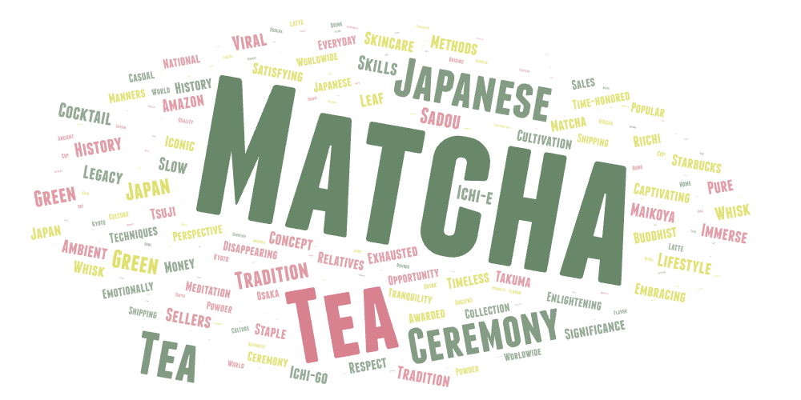
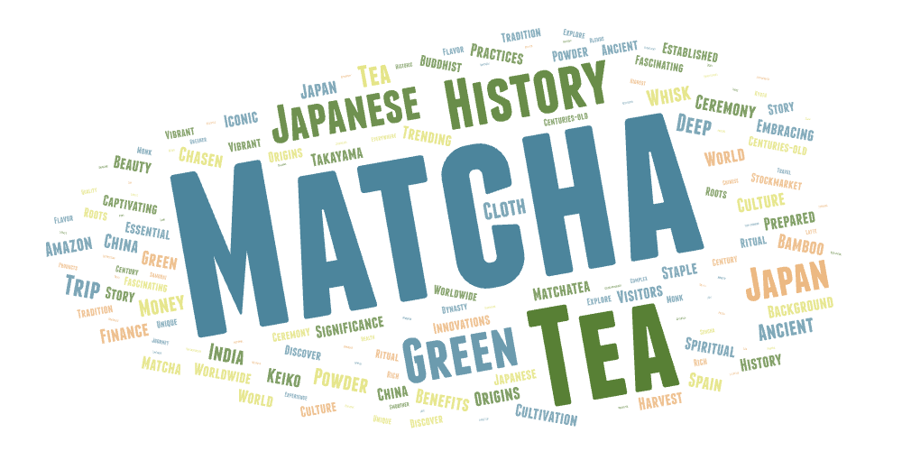

# Matcha on YouTube: Cultural History, Tradition, and Contemporary Representation
*Shayla Guieb*

## Topic and Search Parameters
This project explores how matcha, a green tea with deep cultural and historical roots in Japan, is represented on YouTube through video descriptions. While matcha is traditionally associated with Japanese tea ceremonies, Buddhism, and ritual practice, it has also become a popular global lifestyle and consumer product. To examine how these different meanings appear on YouTube, I collected video data using three related search terms that emphasize culture and history:   
- "matcha tea ceremony"
- "history of matcha"
- "traditional matcha"
Each search term was used to scrape a separate set of YouTube video results using the provided script. The short descriptions of these viedeos were then analyzed using word clouds to identify dominant themes and patterns in language use.

## Purpose of the Comparison
I chose to compare these search terms because, while they all refernce matcha's cultural and historical significance, they frame the topic slightly differently. My expectation was that videos explicitly referencing "history" or "tea ceremony" would surface more historically grounded language, while broader searches might emphasize contemporary lifestyle or consumption. By comparing word clouds generated from all matcha-related data combined and from history-focused result only, I aimed to examine whether historical framing meaningfully changes how matcha is discussed on YouTube.

## Comparison of Word Clouds

### Word Cloud: All Matcha Results

This word cloud was created using video descriptions from all three search terms combined. Dominant words include *matcha*, *tea*, *Japanese*, *ceremony*, and *green*. The prominence of these terms suggests that YouTube descriptions rely heavily on broad cultural identifiers and familiar associations, rather than detailed historical narratives.

### Word Cloud: History of Matcha

This word cloud was generated using only videos returned from the search term “history of matcha.” While words such as *history*, *ancient*, *origins*, and *culture* appear more frequently than in the combined cloud, the largest and most dominant terms remain *matcha*, *green tea*, and *Japan*. Overall, the history-focused cloud closely resembles the combined cloud, with only subtle shifts toward historical language.

## Observed Patterns and Possible Explanation
The similarity between the two word clouds suggests that even when users search explicitly for historical information, YouTube video descriptions continue to frame matcha in generalized and accessible ways. One possible explanation is that YouTube prioritizes content that is visually appealing, monetizable, and optimized for search algorithms. As a result, creators may emphasize lifestyle, aesthetics, or broad cultural references rather than in-depth historical detail. Additionally, historical knowledge may be simplified or aestheticized to appeal to wider audiences who are more interested in consumption or personal wellness than academic history.

## Reflections and Unexpected Findings 
Before conducting this analysis, I expected historical language to be much more prominent in the “history of matcha” word cloud. Instead, I was surprised by how closely it mirrored the combined dataset. This suggests that matcha’s historical and cultural depth may be flattened in popular digital representations, even when history is explicitly referenced. Rather than presenting matcha as a historically situated practice, YouTube descriptions often treat it as a timeless or universally understood cultural symbol.

## Future Improvements
This research could be improved. Future studies could include searches conducted in Japanese, which may surface more historically detailed content. Analyzing video transcripts instead of short descriptions might also reveal deeper historical discussions that are not captured in metadata. Additionally, comparing YouTube with other platforms such as museum websites, academic lectures, or documentary archives could provide a more nuanced understanding of how matcha’s history is communicated across different digital spaces.

## CSV Files
### Data Downloads
- [Matcha Tea Ceremony CSV](assets/search-result-1.csv)
- [History of Matcha CSV](assets/search-result-2.csv)
- [Traditional Matcha CSV](assets/search-result-3.csv)
